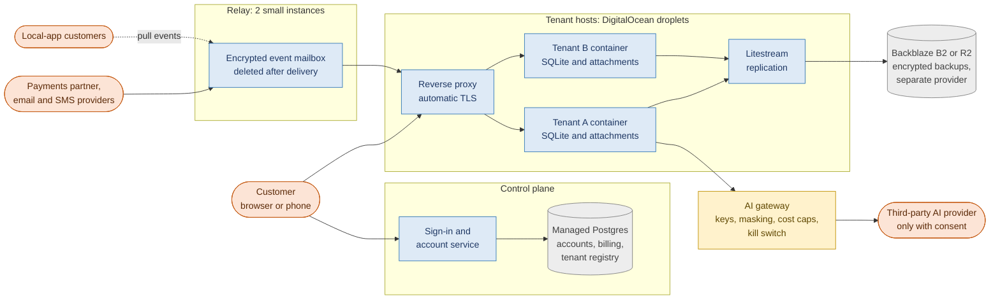
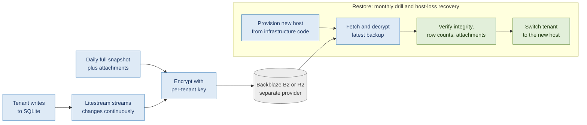

# Hosting Plan

**Product:** Property management app for independent managers (about 10-50 doors, managing for other owners)
**Scope:** Hosting for the Hosted tier (roadmap Phase 1), the relay and payment webhooks (Phase 2), backups, and the small services the local tier needs.
**Companion documents:** Phased Roadmap v2, Break-Even Funding Model, Spreadsheet Import Approach.

**How to read this document**
- Prices and incident figures come from third-party summaries dated through mid-2026 (see Sources). Verify each against the provider's official pricing page before committing.
- Numbers marked **[hypothesis]** are starting points to measure, not recommendations or guarantees.
- Nothing here is legal or compliance advice. Data-protection, breach-notification, and payments rules need review by a qualified professional.

> **About the diagrams:** The figures are [Mermaid](https://mermaid.js.org) code blocks. They render in GitHub, GitLab, Obsidian, and most Markdown editors with Mermaid support.

---

## 1. Summary

- **Compute:** DigitalOcean Droplets in a US region, running one small container per customer (a SQLite workspace plus attachments). AWS Lightsail is an equal alternative if you want the AWS path.
- **Backups:** Litestream replicates every tenant database to object storage at a *different* provider (Backblaze B2, or Cloudflare R2). Everything is encrypted before upload. Provider snapshots are a secondary layer only.
- **Control plane:** a small managed Postgres for accounts, billing, the tenant registry, and relay metadata. Customer records stay in per-tenant SQLite, as decided in the database discussion.
- **Relay:** two small instances, separate from tenant hosts, holding encrypted events until they are delivered.
- **Keep it portable:** plain containers, a reverse proxy, infrastructure as code, and S3-compatible storage, so a provider can be replaced in days.
- **Avoid for now:** Fly.io as the primary home for customer data (reliability concerns), and managed platforms that add a dependency on someone else's cloud account.
- **Cost:** roughly $75/month at the start, about $190/month at 50 tenants, and about $425/month at 150. That is about $7.50, $3.80, and $2.80 per tenant, excluding managed AI usage and provider fees.
- **Reliability targets [hypothesis]:** 99.5% monthly availability, data loss limited to minutes, and recovery from a lost host within an hour. Treat these as internal targets until you have proven them.

---

## 2. Goals and requirements

| Goal | What it means in practice |
|---|---|
| Customers use; you maintain | No server work for customers. You own updates, backups, and monitoring. |
| Ownership contract | Per-tenant isolation, a one-click export of the full workspace, and a clear list of what you store. |
| Same workspace everywhere | Hosted tenants run the same SQLite workspace format as local, so moving either way is a file copy. |
| Low cost per tenant | Hosting plus managed AI must fit inside the 75% gross margin in the funding model ($12.50 per customer at $50/month). |
| Honest reliability | Modest targets you can meet alone, with a status page and a tested restore, instead of promises you cannot keep. |
| Least data held | Minimize what the control plane, relay, and AI gateway store. Delete event data after delivery. |
| Replaceable providers | Nothing depends on one provider's proprietary service. |

---

## 3. Architecture

*Figure 1. Hosting architecture for Phases 1-2. Blue = your code and services, amber = AI, gray = storage, orange = outside parties.*

| Component | Role | Notes |
|---|---|---|
| Tenant hosts | Run one container per customer with its SQLite database and attachments on a local volume | Start at about 15 tenants per 4 GB host **[hypothesis]**. Measure real memory and CPU per tenant, then set limits. |
| Reverse proxy | Terminates TLS and routes each tenant subdomain to its container | Automatic certificates; per-tenant subdomains. |
| Litestream | Streams each tenant database to object storage | Covers the database only. Attachments need their own sync (see section 5). |
| Control plane | Sign-in, account recovery, billing metadata, and the registry of which tenant lives on which host | Small managed Postgres, or SQLite at the very start. |
| Relay | Holds encrypted inbound events (payments, email, SMS) until a local app pulls them, then deletes them | Hosted tenants receive events directly. Use idempotency keys and at-least-once delivery. |
| AI gateway | Holds AI provider keys, masks and minimizes text, enforces per-tenant cost caps, honors the kill switch, and logs metadata only | Satisfies the roadmap's managed AI default and consent model. |
| Static site and update feed | Marketing page, installer downloads, update manifests | Cloudflare Pages or object storage behind a CDN; check current plan limits. |
| Monitoring | External uptime checks, host metrics, log search, alerts, status page | Keep the uptime checker independent of your hosting provider. |

**Tenant placement:** The control plane's registry maps each tenant to a host. To move a tenant, restore its latest backup on the target host, verify it, then switch routing. This is the same procedure as disaster recovery, so you rehearse it constantly.

**Credential custody:** Hosted tenants need their email and SMS authorizations stored on your side. Store them in an encrypted secrets store with per-tenant keys, exclude them from general backups unless encrypted separately, and treat this as a new obligation compared with the local tier.

---

## 4. Provider choices

| Component | Recommendation | Why | Alternative and switch trigger |
|---|---|---|---|
| Tenant compute | DigitalOcean Droplets, US region | Simple, predictable pricing. Shared-CPU plans: $6 (1 GB), $12 (2 GB), $24 (4 GB) per month. Per-second billing since January 2026. | **AWS Lightsail** ($5, $7, $12 plans) if you want the AWS path or startup credits; watch burstable CPU. **Hetzner** for staging or later cost savings; it raised prices twice in 2026 and its US sites are leased capacity. |
| Control plane database | Managed Postgres, about $15/month to start | Avoids running your own database for accounts and billing | SQLite at first if you want $0; move when you add billing |
| Backup storage | Backblaze B2 ($6.95 per TB per month, free egress up to 3x stored data) | Cheapest durable option for small backups | **Cloudflare R2** (about $15 per TB, no egress fees) if restore traffic becomes large |
| Relay | Two small Droplets ($12 each) | Isolated from tenant data and from tenant host failures | A managed queue service later |
| Static site and downloads | Cloudflare Pages or object storage plus CDN | Cheap and fast | Any static host |
| Provider backups | DigitalOcean weekly or daily backups (+20% or +30% of Droplet cost) | A second layer only. They are crash-consistent, kept in the same data center, and exclude attached volumes. | Drop them if Litestream plus snapshots prove sufficient |
| **Not now** | Fly.io as primary; managed platforms (Render, Railway, and similar) | Fly.io is cheap per unit, but third-party trackers show dozens of incidents in 90 days and 98.59% uptime in one count (including minor events), plus 2026 billing changes. One report says Railway went offline for 8 hours in May 2026 after its own cloud account was suspended. | Revisit after a sustained clean record |

---

## 5. Backups, restore, and availability

*Figure 2. Backup flow and the restore procedure. Blue = automated, gray = storage, green = verified by a person or checks.*

**What gets backed up**
- **Database:** continuous Litestream replication to B2 or R2, plus a daily full snapshot.
- **Attachments:** a separate sync to object storage (for example restic or rclone), because Litestream covers only the database. A verification step checks that every attachment referenced by the database exists in the backup.
- **Encryption:** encrypt before upload with a per-tenant key you control. Confirm Litestream's current encryption support, or encrypt the snapshot and attachment sets with a separate tool.
- **Retention [hypothesis]:** daily for 14 days, weekly for 8 weeks, monthly for 12 months, matching the roadmap's versioning idea. Define how long deleted customers' backups remain, and state it in your privacy statement.
- **Excluded:** hosting-provider snapshots are a convenience, not your recovery plan.

**Targets [hypothesis]**

| Measure | Target |
|---|---|
| Monthly availability | 99.5% (about 3.6 hours of downtime per month) |
| Data loss on host failure (RPO) | A few minutes |
| Time to recover from a lost host (RTO) | Under 60 minutes |
| Restore drill | Monthly per sample tenant; full rebuild from code quarterly |

**Single-host risk:** One host failing takes down all tenants on it until you restore them. That is acceptable for pilots and early customers if it is stated plainly. When customers need better, add a warm standby per host group (it roughly doubles compute cost) or spread tenants so a single failure affects fewer of them.

**Silent failure risk:** The most dangerous failure is a backup that stopped working. Alert on replication lag, backup age, and failed restore drills, and treat a stale backup like an outage.

---

## 6. Security and privacy

- **Accounts:** multi-factor authentication on every cloud, registrar, and code account. Separate production and staging accounts. Least-privilege access and a short list of people with production access.
- **Tenant isolation:** one container, user, and volume per tenant, with memory and CPU limits. Per-tenant encryption keys. No tenant can see another's files.
- **Encryption:** TLS everywhere. Decide on at-rest encryption before pilots hold applicant data: SQLite does not encrypt files on its own, so use disk encryption plus encrypted backups, or SQLCipher.
- **Secrets:** a managed or well-protected secrets store. Never in images, source, or logs.
- **Logs:** no tenant content or personal details. Log metadata, errors, and identifiers only.
- **Data minimization:** the relay deletes events after delivery with a maximum time limit (for example 14 days **[hypothesis]**). The AI gateway sends only minimized, masked text, and only with consent shown on the data-flow screen.
- **Access to customer data:** support access is off by default, time-limited, consented, and logged.
- **Retention and deletion:** a documented schedule for deleting a tenant and purging its backups.
- **Incident response:** a short written plan covering detection, containment, customer notification, and legal review. Breach-notification rules vary by state, so get advice.
- **Compliance:** do not claim SOC 2 or similar until you have it. A first SOC 2 is commonly quoted at roughly $30k-$90k all in, so defer it until customers require it. Review your providers' own compliance reports as part of vendor selection.
- **Vendor list:** keep a current list of every provider that touches customer data (hosting, backups, relay, AI, payments, email, SMS) for your privacy statement.

---

## 7. Operations

**Build and deploy**
- Infrastructure as code (for example Terraform or OpenTofu) for servers, DNS, and firewalls, plus a repeatable host setup. A new host should be reproducible from code in minutes.
- Containers built in CI, scanned, and deployed in stages: your own test tenants first, then volunteer pilots, then everyone.
- **Migrations:** each tenant database carries a schema version. On start, the app snapshots the database, runs migrations, and verifies integrity. A runner reports which tenants migrated, which failed, and which rolled back. Roll back by restoring the snapshot and the previous image.

**Monitoring and alerts**
- Per-tenant health checks, host CPU, memory, and disk, replication lag, backup age, certificate expiry, error rates, relay queue depth, and AI gateway cost per tenant.
- A public status page. Alerts reach a phone, with a plain-language escalation path.

**Capacity management**
- Track memory and CPU per tenant. Add a host when the busiest one passes about 70% memory **[hypothesis]**.
- Place new tenants on the least-loaded host. Rebalance with the restore-and-switch procedure.

**Support model**
- State business-hours support at first. Do not promise 24/7 response unless you can deliver it. A solo founder on call is itself a reliability risk.

**Runbooks to write before the first hosted pilot**
- Host failure, tenant restore, stale backup, certificate failure, relay backlog, AI provider outage, leaked credential, and a customer asking for deletion or export.

---

## 8. Cost plan

**Assumptions**
- DigitalOcean 4 GB shared Droplet at $24/month hosts about 15 tenants **[hypothesis, measure it]**.
- Provider backups add 20% to host cost.
- Managed Postgres about $15/month to start, larger at scale **[hypothesis]**.
- Relay: two $12 Droplets in Phase 2, two $24 Droplets at scale.
- B2 storage is negligible at this size (roughly $1-5/month).
- Monitoring and logging $20-40 and domains, email sending, and miscellaneous $10-15 **[hypothesis]**.

| Line | Phase 1 (up to ~10 tenants) | Phase 2 (up to ~50) | At scale (~150) |
|---|---|---|---|
| Tenant hosts | $24 (1 host) | $96 (4 hosts) | $240 (10 hosts) |
| Provider backups (+20%) | $5 | $19 | $48 |
| Control plane database | $15 | $15 | $30 |
| Relay | $0 | $24 | $48 |
| Backup storage | $1 | $2 | $5 |
| Monitoring and logging | $20 | $25 | $40 |
| Domains, email sending, misc | $10 | $10 | $15 |
| **Total per month** | **about $75** | **about $191** | **about $426** |
| **Per tenant** | **about $7.50** | **about $3.80** | **about $2.80** |

**Not included:** managed AI usage, payment partner fees, email and SMS provider fees, your own time, taxes, SOC 2, and legal review.

**Against the funding model:** the model allows $12.50 per customer per month for hosting, managed AI, and tools. Hosting uses roughly $2.80-$7.50 of that, which leaves about $5-$10 for AI and tools. Early per-tenant cost is higher because fixed costs are spread over few customers. This table is more complete than the quick estimate in the earlier chat answer, which left out the control plane and relay.

---

## 9. Rollout by roadmap phase

| Phase | Hosting work | Exit check |
|---|---|---|
| 0: Pilot readiness | No tenant hosting. Static site, update feed, backup destination guidance. Optional diagnostics upload endpoint. | Restore tested on local installs. |
| 1: Hosted option | Control plane, first tenant host, infrastructure as code, Litestream and attachment backups, monitoring, status page, security baseline, restore drill, managed AI gateway. | Hosted/local round trip with no data loss; a full restore from backup on a fresh host; 30 days with no data loss. |
| 2: Connectivity | Relay, webhook endpoints with signature checks, idempotency, retries and dead-letter handling, second tenant host as needed. | 30 days with no lost or duplicated events; relay holds nothing past delivery. |
| 3: Reach | Public owner and tenant link endpoints behind rate limiting; phone companion API; link expiry and revocation. | Abuse and error monitoring in place; no cross-tenant access in testing. |
| 4: Team and financial workflow | Multi-seat load tests against SQLite write contention; roles and audit logs; bank feed connections with secured tokens. | Write-lock errors stay low with real seats. |
| 5: Trust-accounting readiness | Longer retention, tamper-evident audit logs, stricter access, professional review of controls. | Review complete. |
| 6: Scale | Warm standbys, second region if justified, cost review, SOC 2 decision, re-check database triggers. | Support and cost per tenant sustainable. |

---

## 10. Risks and mitigations

| Risk | Mitigation |
|---|---|
| A provider raises prices or has an outage | Portable stack, infrastructure as code, backups at another provider, and a rehearsed move |
| A tenant host fails | Restore from backup onto a new host; warm standby later |
| Backups silently stop working | Alerts on lag and age, monthly restore drills |
| Lost or leaked encryption keys | Key backup procedure, per-tenant keys, rotation plan, clear policy on lost keys |
| Noisy neighbor on a shared host | Per-container limits and placement monitoring |
| Email or SMS credentials leaked | Encrypted vault, per-tenant keys, re-authorization flow, least access |
| Data breach | Isolation, minimization, encryption, logging without content, incident plan, insurance review |
| AI sends too much data | Gateway masking, consent, kill switch, review of provider retention and training terms |
| Schema migration breaks tenants | Snapshot first, staged rollout, rollback, migration report |
| SQLite write contention with multiple seats | Load tests in Phase 4; revisit the Postgres triggers if it appears |
| Solo operator burnout or unavailability | Modest targets, automation, runbooks, business-hours support, a trusted backup contact |
| Hosting cost grows faster than revenue | Track cost per tenant monthly, set alerts, right-size hosts |

---

## 11. Open decisions and things to verify

**Decisions**
- DigitalOcean or Lightsail as the final primary provider.
- Backblaze B2 or Cloudflare R2 for backups.
- Containers on shared hosts only, or dedicated hosts for larger customers.
- Key management: self-managed or a managed key service.
- Relay encryption scheme and event lifetime.
- At-rest encryption approach for tenant databases.
- Status page and monitoring tools.
- Support hours and on-call arrangement.
- Whether to offer any non-US region (not planned).

**Verify before committing**
- Current prices, limits, and uptime commitments on each provider's official site.
- Provider compliance reports and data-processing terms.
- Litestream's current version, encryption support, and restore behavior with your attachment layout.
- Backblaze and Cloudflare storage terms and current free-tier limits.
- Email and SMS authorization requirements for hosted tenants (for example, provider app verification).
- Payments partner webhook retry behavior and signature methods.
- Breach-notification and data-protection requirements in your target states.
- Insurance options for cyber and errors-and-omissions coverage.

---

## Sources

Third-party summaries used for pricing and reliability context (verify against official pages):
- Fly.io pricing (fly.io/pricing) and 2026 billing change coverage (sota.io blog: Fly.io hidden costs 2026).
- Fly.io incident history trackers (pingoru.io/providers/flyio).
- Hetzner 2026 price changes (privatedevops.com, datacenterdynamics.com, bitdoze.com reviews).
- DigitalOcean Droplet pricing (digitalocean.com/pricing/droplets) and cost breakdowns (diyai.io, valebyte.com).
- AWS Lightsail pricing coverage (onedollarvps.com, bestusavps.com, cloudzero.com).
- Backblaze B2 and Cloudflare R2 pricing comparisons (sliplane.io, tech-insider.org, speedtesthq.com).
- Litestream overview and production use (jacar.es Litestream article; simonwillison.net).
- PGlite project and adoption (pglite.dev; electric.ax blog).
- Railway outage report (privatedevops.com, June 2026).
- SOC 2 cost breakdown (bdemerson.com/article/soc-2-cost).
